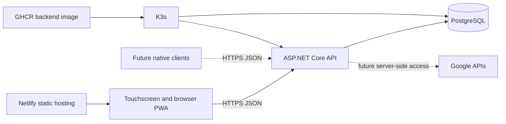

# Architecture

## System shape

The frontend and backend are independent deployables. The production frontend is static content and calls a configured API origin directly. Netlify is a deployment choice, not an application runtime dependency; the same output can be served by the supplied frontend container or another static host.

The backend is a modular monolith. Domain and persistence code are organized by feature inside one project while business behavior remains small. Separate services, queues, CQRS, and distributed infrastructure are intentionally absent.

## API boundary

The initial API exposes only:

- `/health/live` for process liveness;
- `/health/ready` for PostgreSQL connectivity;
- development-only OpenAPI JSON.

Future browser and native clients will use stable JSON endpoints with backend-enforced authorization. Formal API-versioning infrastructure will be introduced only when a second contract or a compatibility need exists.

## External data

Google Calendar and Google Tasks remain their own sources of truth. Future integrations will use backend service interfaces, stable external identifiers, and disposable caches. They will not copy external data into the product-owned chore/reward schema.

## Touch-first frontend

The initial UI uses semantic React components and plain CSS design tokens. It targets 48-pixel minimum touch areas, visible keyboard focus, responsive layout, reduced motion, and no essential hover behavior. It has no global state, router, component framework, or offline mutation system.

## Deployment boundaries

- Netlify builds only `src/frontend`.
- GHCR receives only the backend production image in the first milestone.
- K3s runs the backend, migration job, and optionally PostgreSQL.
- Secrets enter the backend and K3s at runtime; they never enter frontend builds.
- The frontend container is a portable static-hosting fallback.
