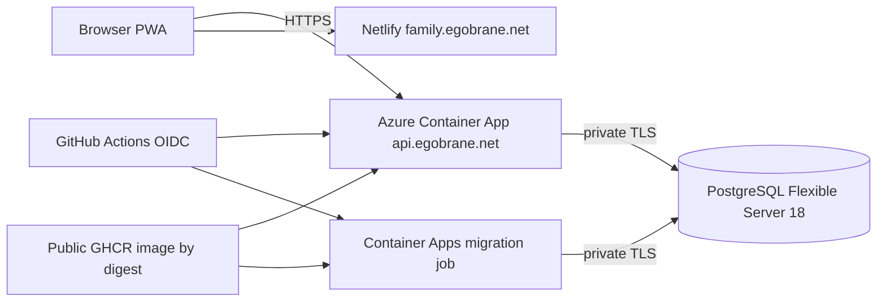

# Azure staging deployment

## Topology

The API and job share a workload-profile Container Apps environment connected to a delegated VNet subnet. PostgreSQL uses a separate delegated subnet and private DNS zone. Public database networking is disabled.

## Provisioning region and prerequisites

On 2026-08-12, Azure CLI was logged into subscription `b8255fca-4e0c-4f4b-933b-1cd8fcbc91b8`, and both `Microsoft.App` and `Microsoft.DBforPostgreSQL` were registered. Azure continued to restrict PostgreSQL provisioning in East US, while Central US advertised PostgreSQL 18 and `Standard_B1ms`. The owner explicitly approved moving the complete staging stack to Central US.

See [`deploy/azure/README.md`](../../deploy/azure/README.md) for commands and safety checks.

## Current staging instance

Provisioned successfully on 2026-08-12:

- API: `family-dashboard-staging-api`
- Default API origin: `https://family-dashboard-staging-api.calmplant-86bcedd8.centralus.azurecontainerapps.io`
- Migration job: `family-dashboard-staging-mig`
- PostgreSQL server: `family-dashboard-staging-pg-rwzkcdch6czlm`
- Container Apps environment: `family-dashboard-staging-env`
- Azure-managed infrastructure resource group: `ME_family-dashboard-staging-env_ryan-dev_centralus`
- GitHub OIDC client ID: `537b279f-60d3-4e5a-ac7f-bfc5120b8dc4`
- Tenant ID: `204a8dcb-68e2-4947-95a8-ed313d75b397`
- Subscription ID: `b8255fca-4e0c-4f4b-933b-1cd8fcbc91b8`

The initial migration execution succeeded. Both default-hostname and `https://api.egobrane.net` health endpoints return HTTP 200. Azure managed TLS is active with insecure ingress disabled.

## Runtime configuration and secrets

The generated PostgreSQL password enters Bicep through `FAMILY_DASHBOARD_POSTGRES_ADMIN_PASSWORD`. Bicep marks it secure and stores the resulting connection string only as Container Apps secrets. It must also be retained in an owner-controlled password manager for emergency administration. It must never enter Git, GitHub variables, Netlify, logs, command-line arguments, or the frontend.

The API receives exact CORS origin `https://family.egobrane.net`, listens on port 8080, and uses TLS-required PostgreSQL connections. The frontend receives only public `VITE_API_BASE_URL=https://api.egobrane.net`.

## DNS and managed TLS

Custom-domain activation is deliberately staged. First deploy without the binding and obtain Azure's default hostname and verification ID. Create CNAME `api` and TXT `asuid.api` records, initially without a reverse proxy. After validation resolves, attach the hostname without a certificate using `az containerapp hostname add`; Azure will otherwise reject managed-certificate creation. Then enable the custom domain in Bicep and redeploy so Azure can issue and bind its managed certificate. If Cloudflare proxying is desired later, enable it only after Azure origin TLS and health checks are proven.

## Deployment and rollback

The initial infrastructure deployment is manual under the developer identity. Routine backend deployments use the protected GitHub `staging` environment and OIDC, accept only the approved GHCR repository pinned by digest, run migrations first, then update the API and verify both health endpoints.

The workflow pins Azure Container Apps CLI extension `1.3.0b4` because the required job commands are currently delivered through that preview extension. Review and deliberately update the pin when Azure publishes a suitable stable version.

For an application rollback, reactivate a healthy previous Container Apps revision or redeploy its prior digest. Database migrations are forward-only: use a forward fix when possible. If a migration irreversibly damages data, restore PostgreSQL point-in-time backup to a new server, validate it, then redirect the application through a reviewed infrastructure update. Never overwrite the original server during a restore drill.

## Backup and recovery

The staging server uses seven-day Azure automated backups with point-in-time restore and no geo-redundancy. Before storing irreplaceable household data:

1. record recovery point and recovery time objectives;
2. perform a point-in-time restore to a separately prefixed temporary server;
3. validate schema and representative data;
4. document the measured restore time;
5. remove the temporary server only after explicit review.

Burstable PostgreSQL has backup and performance limitations. Increase retention, add geo-redundancy, or move to General Purpose before production requirements justify the cost.

## Cost categories

- PostgreSQL B1ms compute and 32 GiB storage are the main predictable monthly cost.
- Container Apps Consumption charges for requests/compute while active; min replicas zero reduces idle compute but introduces cold starts.
- Log Analytics charges by ingestion and retention.
- Managed certificate, VNet, private DNS, and OIDC identity are generally low/no direct cost, while data transfer and DNS-provider fees may apply.

Azure pricing and sponsorship-credit treatment must be checked at deployment time. Budgets and alerts should be configured outside this app-scoped template because the shared resource group contains unrelated workloads.
