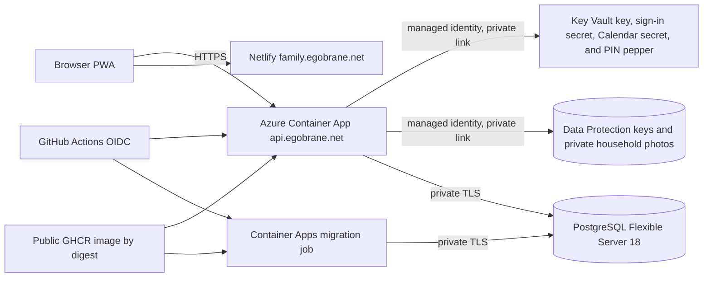

# Azure staging deployment

Google Tasks reuses the runtime identity, private Key Vault, Blob-backed Data Protection key ring, Container App, and PostgreSQL server. Increment 1 adds a dedicated Key Vault secret reference and separate OAuth settings. Increment 2 adds no Azure resource or secret: `enableGoogleTaskMutations` maps to a separate runtime gate that was enabled only after migration and broad-scope approval. Migration and scheduled jobs receive neither the Tasks secret nor provider tokens. See [Google Tasks integration](../google-tasks.md).

## Topology

The API and job share a workload-profile Container Apps environment connected to a delegated VNet subnet. PostgreSQL uses a separate delegated subnet and private DNS zone. Public database networking is disabled.

## Provisioning region and prerequisites

On 2026-08-12, Azure CLI was logged into subscription `b8255fca-4e0c-4f4b-933b-1cd8fcbc91b8`, and both `Microsoft.App` and `Microsoft.DBforPostgreSQL` were registered. Azure continued to restrict PostgreSQL provisioning in East US, while Central US advertised PostgreSQL 18 and `Standard_B1ms`. The owner explicitly approved moving the complete staging stack to Central US.

See [`deploy/azure/README.md`](../../deploy/azure/README.md) for commands and safety checks.

## Current staging instance

Provisioned successfully on 2026-08-12:

- API: `family-dashboard-staging-api`
- Default API origin: `https://family-dashboard-staging-api.calmplant-86bcedd8.centralus.azurecontainerapps.io`
- Migration job: `family-dashboard-staging-mig`
- PostgreSQL server: `family-dashboard-staging-pg-rwzkcdch6czlm`
- Container Apps environment: `family-dashboard-staging-env`
- Azure-managed infrastructure resource group: `ME_family-dashboard-staging-env_ryan-dev_centralus`
- GitHub OIDC client ID: `537b279f-60d3-4e5a-ac7f-bfc5120b8dc4`
- Tenant ID: `204a8dcb-68e2-4947-95a8-ed313d75b397`
- Subscription ID: `b8255fca-4e0c-4f4b-933b-1cd8fcbc91b8`
- Runtime managed identity: `family-dashboard-staging-runtime`
- Data Protection storage account: `familydbrwzkcdch6czlm`
- Authentication Key Vault: `familydb-rwzkcdch6czlm`

The initial migration execution succeeded. Both default-hostname and `https://api.egobrane.net` health endpoints return HTTP 200. Azure managed TLS is active with insecure ingress disabled.

## Runtime configuration and secrets

The generated PostgreSQL password enters Bicep through `FAMILY_DASHBOARD_POSTGRES_ADMIN_PASSWORD`. Bicep marks it secure and stores the resulting connection string only as Container Apps secrets. It must also be retained in an owner-controlled password manager for emergency administration. It must never enter Git, GitHub variables, Netlify, logs, command-line arguments, or the frontend.

The API receives exact CORS origin `https://family.egobrane.net`, listens on port 8080, and uses TLS-required PostgreSQL connections. The frontend receives only public `VITE_API_BASE_URL=https://api.egobrane.net`. Azure Container Apps terminates public TLS at managed ingress, so the API container enables ASP.NET Core forwarded-header processing to preserve the original HTTPS scheme for security-sensitive absolute redirects such as the Google OAuth callback. Managed ingress is the only public route to the container target port.

The API runtime identity can write only the Data Protection Blob container, wrap/unwrap only through the Key Vault key, and read the Google and parent-access secrets. The migration job receives none of these permissions or secrets. Storage shared-key access and public networking are disabled. Key Vault uses RBAC, soft deletion, purge protection, a private endpoint, and public networking disabled. The owner created the Google web OAuth client, placed its secret directly in Key Vault, and activated staging authentication on 2026-08-14. Secrets remain absent from Git, GitHub, Netlify, container images, and browser-delivered configuration.

Increment 6 adds no Azure resource. Before enabling it, generate a random 32-byte value, base64 encode it, store it in the existing vault as `parent-access-pepper-v1` through the secure Bicep parameter template, and then deploy the main template. The API readiness check fails when parent access is enabled without a valid pepper. The migration job deliberately receives neither `ParentAccess__Enabled` nor the pepper.

Calendar Increment 1 reuses the runtime identity, private Key Vault, Blob-backed Data Protection key ring, Container App, and PostgreSQL server. It adds only a separate Key Vault secret reference named `google-calendar-client-secret` and public Calendar client settings. The migration and migration job receive no Calendar client secret. Keep `enableGoogleCalendar=false` while deploying and migrating the first image; activate only after the separate Google web client, exact callback, consent scopes, and Key Vault secret are ready. See [Google Calendar Increment 1](../google-calendar.md).

Calendar Increment 2 adds no Azure resource or secret. `enableGoogleCalendarEventCreation` maps to a separate backend feature gate and defaults to `false` in the reusable template; staging now deliberately sets it to `true` after migration and consent verification. Deploy and migrate a new reviewed image with the gate false, update the separate Google Calendar consent configuration for the exact events scope, and then enable it in a configuration-only deployment of the same digest. Disabling this flag rolls back creation without interrupting Calendar reads.

Calendar Increment 3 also adds no Azure resource, secret, or OAuth scope. `enableGoogleCalendarEventManagement` is an approved runtime setting reconciled and verified by the staging workflow. Its additive receipt migration runs before the same reviewed image is activated. Disable only that setting to stop editing/deletion while retaining reads and creation; the workflow restores its prior value during an automatic failed-release rollback.

## DNS and managed TLS

Custom-domain activation is deliberately staged. First deploy without the binding and obtain Azure's default hostname and verification ID. Create CNAME `api` and TXT `asuid.api` records, initially without a reverse proxy. After validation resolves, attach the hostname without a certificate using `az containerapp hostname add`; Azure will otherwise reject managed-certificate creation. Then enable the custom domain in Bicep and redeploy so Azure can issue and bind its managed certificate. If Cloudflare proxying is desired later, enable it only after Azure origin TLS and health checks are proven.

## Deployment and rollback

The initial infrastructure deployment remains manual under the developer identity. Routine backend publication passes its exact immutable digest directly to the reusable protected GitHub `staging` workflow. Reviewed `staging.bicepparam` continues to own the public runtime allowlist but reads the transient image from `FAMILY_DASHBOARD_BACKEND_IMAGE` instead of storing a release value. The workflow requires successful CI for current `main`, compiles parameters with a disposable PostgreSQL placeholder, never retrieves the real administrator password, runs migrations first, reconciles the API and provisioned chore-generator job, verifies revision, digest, settings, traffic, and health, and attempts to restore the previous application release if verification fails. Database migrations remain forward-only.

This separation protects unrelated resources in `ryan-dev` and preserves the narrow existing OIDC roles. Structural infrastructure, secret-reference, networking, PostgreSQL, identity, or Key Vault changes still require an explicitly reviewed manual Bicep deployment. The protected 2026-08-22 staging run proved the reconciled path end to end: no manual digest input was required, migration completed before the API update, and the workflow verified the reviewed image, runtime allowlist, ready revision, 100% traffic, and public health endpoints.

GitHub issues immutable OIDC subjects for this repository. Azure must trust the exact subject `repo:egobrane@23132912/FamilyBoard@1324023581:environment:staging`; the earlier name-only subject is intentionally not accepted. The identity has Container Apps Contributor on the API and Container Apps Jobs Contributor separately scoped to the migration and chore-generator jobs. Azure's start-time image override replaces the container template and loses arguments/environment, so the workflow updates existing jobs deliberately. Job Contributor is the narrowest suitable built-in role and is granted only on those two prefixed jobs.

Chore Management Increment 2 adds Consumption scheduled job `family-dashboard-staging-chore`. It runs the same immutable backend image hourly at minute 7 with `--generate-chore-assignments`, connects privately to PostgreSQL through the backend-only `postgres-connection` secret reference, and receives no OAuth secret, PIN pepper, or Data Protection key permissions. The shortened Azure resource name remains within the 32-character Container Apps Job limit. Structural provisioning succeeded after the original overlength name failed Azure preflight without creating a partial job; subsequent releases reconcile the job image automatically.

Chore Management Increment 3 adds no Azure resource or secret. Release `7107a784b1471754dce2e9caa9f642431d7aee52` published digest `sha256:b7543874d6a07f6355c309043419672cf9557a002dfb560b19dedff7c0bd6424`; the protected workflow applied `AddChorePointLedger`, reconciled API revision `family-dashboard-staging-api--0000029` and `family-dashboard-staging-chore` to that exact digest, and verified healthy 100% traffic. PostgreSQL remains private and the point ledger uses the existing application database.

Reward Management Increment 1 adds no Azure resource or secret. The protected workflow applied `AddRewardRedemptionWorkflow` before revision `family-dashboard-staging-api--0000030`. Backend-only catalog correction commit `3ac3d23912a254054fa51eedb743f24df6e53966` then published digest `sha256:4974160e513e9406e18a9836dff32daf15866b7d63ab7534d415b4bc942130b9`, completed migration execution `family-dashboard-staging-mig-9oznksx`, and reconciled healthy revision `family-dashboard-staging-api--0000031` plus `family-dashboard-staging-chore` to the same digest. Reward data uses the existing private application database and point ledger.

Google Calendar Increment 3 commit `3343013bae1cb232092b8488c49f8d70f46ede32` published multi-architecture digest `sha256:93ac0319cc0f870c2d12059dd343bbeae7b5b069765342258ae0430570d2dfcf`. The protected workflow completed migration execution `family-dashboard-staging-mig-qg1bzhk`, reconciled healthy revision `family-dashboard-staging-api--0000032` and `family-dashboard-staging-chore` to that digest, enabled the approved event-management setting, and verified 100% API traffic and public health. It added no Azure resource, secret, or OAuth scope.

Google Tasks Increment 1 reuses the same private runtime and adds only its dedicated Key Vault secret reference and public OAuth configuration. Workflow correction commit `e6a25776891dab7a13ff147ace18c8479d59bf87` published reviewed digest `sha256:99c704484334a863addfce2f155ee7522e6d8591b7e3cae4e38c24edab168580`. Its first API attempt failed closed because healthy revision `0000033` received 0% while traffic remained explicitly pinned to `0000032`; the prior revision stayed healthy. The corrected workflow separates readiness from explicit promotion and applies the same explicit behavior during rollback. After the secret-only and structural Bicep deployments, protected run `33185643005` completed migration execution `family-dashboard-staging-mig-qynh433` and reconciled healthy revision `family-dashboard-staging-api--0000037` plus scheduled job `family-dashboard-staging-chore` to the reviewed digest. The API receives `GoogleTasks__ClientSecret` only through secret reference `google-tasks-client-secret`, backed by the versionless private Key Vault URI and runtime managed identity; migration and chore jobs receive no Tasks secret.

Google Tasks Increment 2 adds `AddGoogleTaskMutations` and the reviewed `GoogleTasks__MutationsEnabled` allowlist setting. Implementation commit `b8a9372e67713ce3e121615b575f3d21508efe00` published multi-architecture digest `sha256:858c26934aa0af30f254fd71ef8c5d26856f10a64f118f1b77d3aebd78cbf502`; migration execution `family-dashboard-staging-mig-krltv0a` applied the migration while the gate remained false. Activation commit `f35e25ca1a1464c61b7d2a72d844b8afd2d2c834` passed CI without publishing a redundant image, and protected run `33259719447` reconciled healthy revision `family-dashboard-staging-api--0000039`, 100% traffic, the same digest, and both Tasks flags enabled. Disabling the flag rolls back application mutations; revoking the broad provider grant requires disconnecting the Tasks connection and reconnecting read-only.

Dashboard Personalization adds the private `household-photos` container to the existing storage account. It retains disabled public access, shared-key denial, the existing private endpoint, and managed-identity authorization; no storage secret is created. Weather adds no Azure resource or secret. This staged activation is now proven: the structural Bicep deployment supplied the container URI, the API receives it with the runtime managed-identity client ID, and both media and NWS weather flags are enabled on the reviewed revision. The migration and chore jobs receive no photo configuration. A future clean environment should still migrate first with media disabled, provision the private container, then reconcile the same reviewed digest with media enabled.

The workflow pins Azure Container Apps CLI extension `1.3.0b4` because the required job commands are currently delivered through that preview extension. Review and deliberately update the pin when Azure publishes a suitable stable version.

For an application rollback, reactivate a healthy previous Container Apps revision or redeploy its prior digest. Database migrations are forward-only: use a forward fix when possible. If a migration irreversibly damages data, restore PostgreSQL point-in-time backup to a new server, validate it, then redirect the application through a reviewed infrastructure update. Never overwrite the original server during a restore drill. The exact traffic-shift, restoration, validation, and recovery-objective procedure is maintained in the [application recovery runbook](recovery.md).

After any session has been activated as a shared display, do not roll the API back to pre-Increment-6 code: that code does not enforce the parent-PIN policy. Revoke every shared session first, or use a forward fix. The additive schema itself remains compatible with the previous API.

## Backup and recovery

The staging server uses seven-day Azure automated backups with point-in-time restore and no geo-redundancy. Before storing irreplaceable household data:

1. record recovery point and recovery time objectives;
2. perform a point-in-time restore to a separately prefixed temporary server;
3. validate schema and representative data;
4. document the measured restore time;
5. remove the temporary server only after explicit review.

The first drill ran on 2026-08-13. Azure restored `family-dashboard-stg-pitr-20260813` privately to the 15:55 UTC point. The Azure activity log measured 7 minutes 4 seconds from restore start to server success. Temporary job execution `family-dashboard-pitr-verify-4z2ymsc` completed a read-only transaction and confirmed `family_dashboard`, both deployed EF migrations, and readable household/account tables. The original readiness endpoint remained healthy. The verifier and restored server were then deleted; no staging connection or DNS target changed.

Burstable PostgreSQL has backup and performance limitations. Increase retention, add geo-redundancy, or move to General Purpose before production requirements justify the cost.

## Cost categories

- PostgreSQL B1ms compute and 32 GiB storage are the main predictable monthly cost.
- Container Apps Consumption charges for requests/compute while active; min replicas zero reduces idle compute but introduces cold starts.
- Log Analytics charges by ingestion and retention.
- Managed certificate, VNet, private DNS, and OIDC identity are generally low/no direct cost, while data transfer and DNS-provider fees may apply.
- Standard Key Vault operations, LRS Blob capacity/transactions, and both private endpoints add small ongoing charges even while Container Apps scales to zero.

Azure pricing and sponsorship-credit treatment must be checked at deployment time. Budgets and alerts should be configured outside this app-scoped template because the shared resource group contains unrelated workloads.
